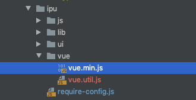

# 如何在ipu里使用vue
```2020-07-01```
::: tip 
因为ipu是遵循amd规范的，所以在script标签里直接引入是会有冲突的。
下面介绍下如何在ipu里正确使用vue
:::
## 引入vue包
1.在[vue官网](https://cn.vuejs.org/v2/guide/installation.html)上直接下载vue文件

2.在ipu框架里的ipu文件下新增vue文件



3.在require-config.js里配置
```
 'vue' : 'ipu/vue/vue.min',
 'vus' : 'ipu/vue/vue.util'
```

## 在业务页面里使用
1.index.js
```
require(["vue"], function (Vue) {
    var vm = new Vue({
        data: {
            message: 'hello world',
            list: [
                { id: 1, title: 'My journey with Vue' },
                { id: 2, title: 'Blogging with Vue' },
                { id: 3, title: 'Why Vue is so fun' }]
        },
        methods: {
            click: function () {
                console.log('点击了一下');
            }
        }
    }).$mount('#app');
})
```
2.index.html
```
<!DOCTYPE html>
<html lang="en">
<head>
    <title>test</title>
    <meta charset="UTF-8">
    <script src="ipu/lib/requirejs/require.js"></script>
    <script src="biz/js/common/require-config.js"></script>
    <script src="ipu/require-config.js"></script>

    <link href="tt/vue/components/example/example.css" rel="stylesheet" type="text/css"/>
    <script type="text/javascript" src="tt/vue/components/example/example.js"></script>
    <script type="text/javascript" src="tt/vue/index.js"></script>
</head>
<body>
<div id="app">
    <div>ssss</div>
    <div @click="click">{{message}}</div>
    <example
            v-for="item in list"
            :key="item.id"
            :title="item.title">
    </example>
</div>
</body>
</html>
```
其中example.js里是用vue自定义的组件，example.css是组件的样式

3.example.js
```
require(["vue"],
    function (Vue) {
        Vue.component('example', {
            props: ['title'],
            template: `
              <div class="res-list">
                <div class="res-list-head">
                  {{title}}
                </div>
                <slot></slot>
              </div>
            `
        });
    });
```


